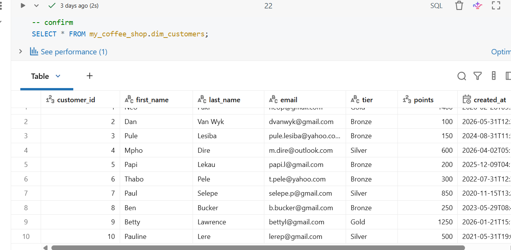
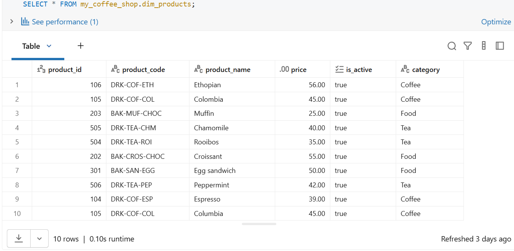

# Exercise 02: DDL & DML on Databricks

## Course
BrightLearn Advanced SQL

---

# Problem Statement

A coffee shop requires a structured database to store customer information, product details, and sales transactions. Without a properly designed database, managing customer loyalty, tracking products, and analyzing sales becomes difficult and inefficient.

---

# Aim of the Project

To design and implement a star schema database in Databricks using DDL and DML commands, enabling efficient storage, management, and maintenance of customer, product, and order data.

---

# Objectives

The following steps were completed to achieve the project aim:

1. Created the `my_coffee_shop` schema and set it as the active schema.
2. Created dimension and fact tables:
   - dim_customers
   - dim_products
   - fact_orders
3. Inserted customer and product records.
4. Renamed the `loyalty_points` column to `points`.
5. Verified table structures using `DESCRIBE TABLE`.
6. Updated Bronze customer loyalty points.
7. Created a backup table using `CREATE TABLE AS SELECT`.
8. Deleted a customer record using a primary key filter.
9. Verified database activity using `DESCRIBE HISTORY`.

---

# Summary of Results

The star schema was successfully created and populated in Databricks.

Key achievements:

- Created a fully functional database schema.
- Successfully inserted customer and product data.
- Renamed columns using ALTER TABLE.
- Updated customer records using UPDATE.
- Created a backup table for data protection.
- Deleted records safely using a WHERE clause.
- Verified all database operations through Databricks history logs.

The exercise demonstrated practical use of DDL and DML commands in a real-world database environment.

---

# Tools Used

- Databricks SQL
- GitHub
- Delta Lake
- SQL DDL Commands
  - CREATE
  - ALTER
  - DROP
- SQL DML Commands
  - INSERT
  - UPDATE
  - DELETE

---

# Screenshots

## Databricks Catalog

Shows the `my_coffee_shop` schema and all created tables.


---

## Customer Table

Shows customer records successfully inserted and the renamed `points` column.



---

## Product Table

Shows product records successfully inserted into the product dimension table.



---

## Delta History

Shows the DELETE operation recorded in the Delta Lake transaction history.


---

# Project Structure

```text
exercise_02/
│
├── Exercise_02_Notebook.ipynb
├── README.md
├── Mycoffeeshop.png
├── dimcustomerstable.png
├── dimproductstable.png
├── historydimcustomer.png
└── Exercise_02_Evidence.docx
```

---

# Task Summary

### Task 1: Create Schema
Created the `my_coffee_shop` schema and set it as the active schema.

### Task 2: Create Tables
Created the dimension and fact tables required for the star schema.

### Task 3: Insert Data
Inserted customer and product records into their respective tables.

### Task 4: Rename Column
Renamed the `loyalty_points` column to `points`.

### Task 5: Describe Table
Verified table structure and data types using `DESCRIBE TABLE`.

### Task 6: Update Data
Updated Bronze customers by increasing their points balance.

### Task 7: Create Backup
Created `dim_customers_backup` using `CREATE TABLE AS SELECT`.

### Task 8: Delete Record
Deleted a customer record using `customer_id` and verified the action using `DESCRIBE HISTORY`.

---

# Author

**Refilwe Sebako**

Data Analyst | Virtual Assistant

---

# Project Value

This project demonstrates:

- Database design using a star schema
- Practical use of DDL and DML commands
- Data maintenance and management
- Data validation and auditing using Delta Lake
- GitHub documentation and portfolio development
